# 📚 Git & GitHub - Complete Guide

> A comprehensive guide to understanding Git concepts and mastering essential commands

## 📑 Table of Contents

- [Core Concepts](#-core-concepts)
  - [1. What Makes Git Stand Out?](#1-what-makes-git-stand-out)
  - [2. Fork vs Clone](#2-fork-vs-clone)
  - [3. Origin and HEAD](#3-origin-and-head)
  - [4. Git Fetch vs Git Pull](#4-git-fetch-vs-git-pull)
  - [5. Understanding Branches](#5-understanding-branches)
  - [6. Git Reset vs Git Revert](#6-git-reset-vs-git-revert)
  - [7. Git Reflog vs Git Log](#7-git-reflog-vs-git-log)
  - [8. Git Amend](#8-git-amend)
  - [9. Git Stash Data Structure](#9-git-stash-data-structure)
  - [10. Detached HEAD State](#10-detached-head-state)
  - [11. Git Rebase vs Git Merge](#11-git-rebase-vs-git-merge)
  - [12. Interactive Rebase Options](#12-interactive-rebase-options)
- [Essential Commands](#-essential-commands)
  - [Configuration](#configuration)
  - [Repository Initialization](#repository-initialization)
  - [Status and Differences](#status-and-differences)
  - [Staging and Committing](#staging-and-committing)
  - [Viewing History](#viewing-history)
  - [Remote Operations](#remote-operations)
  - [Checkout Commands](#checkout-commands)
  - [Branch Management](#branch-management)
  - [Branch Tracking](#branch-tracking)
  - [Merging](#merging)
  - [History Management](#history-management)
  - [Stashing](#stashing)
  - [Advanced Commands](#advanced-commands)

---

## 🎯 Core Concepts

### 1. What Makes Git Stand Out?

Git uses a **snapshot-based** approach rather than a delta-based approach.

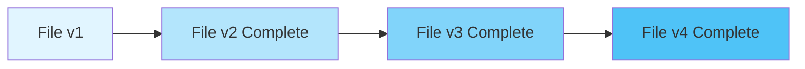

**Key Points:**
- ✅ Git saves the **whole file** when changes are made
- ❌ It does NOT save just the differences between files
- ⚡ No calculations needed to retrieve a file - just pull it from the database
- 🚀 Faster retrieval and simpler architecture

**Example:**
```bash
# When you modify a file and commit
echo "Version 1" > file.txt
git commit -m "First version"

echo "Version 2" > file.txt
git commit -m "Second version"
# Git stores BOTH complete versions, not just the diff
```

---

### 2. Fork vs Clone

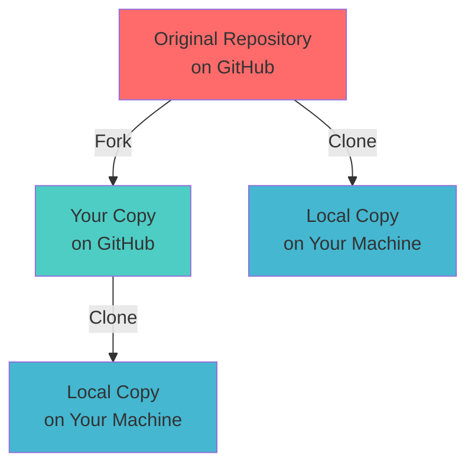

| Feature | Fork | Clone |
|---------|------|-------|
| **Location** | Creates a copy on GitHub | Creates a copy on local machine |
| **Purpose** | Experiment without affecting original | Work on code locally |
| **Independence** | Completely separate repository | Connected to original remote |
| **Use Case** | Contributing to open source | Working on your own projects |

**Example:**
```bash
# Forking (done on GitHub UI - click "Fork" button)

# Cloning your fork
git clone https://github.com/YOUR_USERNAME/repository.git

# Cloning original repository
git clone https://github.com/ORIGINAL_OWNER/repository.git
```

---

### 3. Origin and HEAD

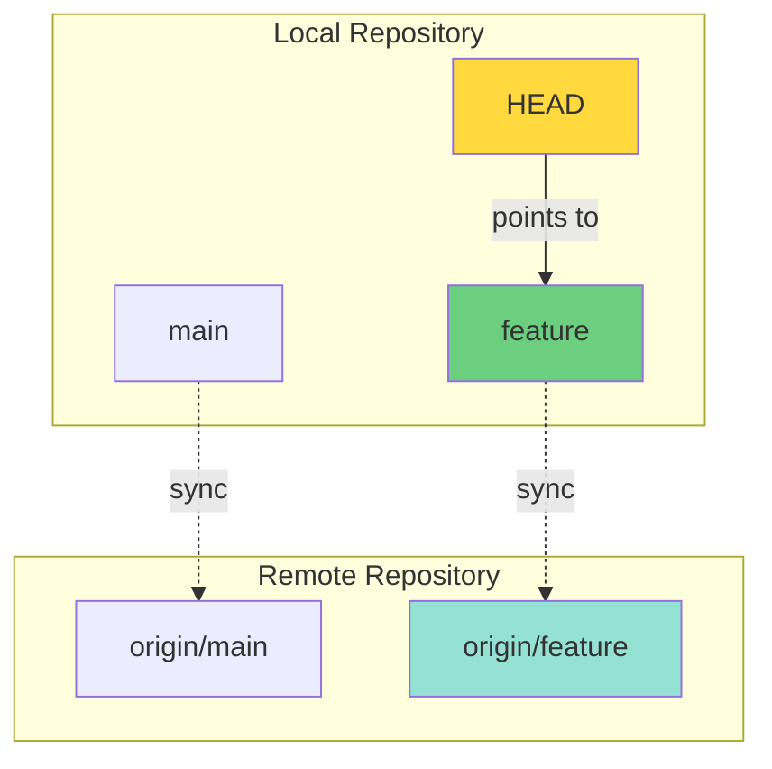

**Origin:**
- Default name for the remote repository
- Created automatically when you clone
- Every local branch has a remote counterpart

**HEAD:**
- Pointer to the **latest commit** in your current branch
- Moves with each new commit
- Tells Git "You are here"

**Example:**
```bash
# View origin URL
git remote -v
# origin  https://github.com/user/repo.git (fetch)
# origin  https://github.com/user/repo.git (push)

# See where HEAD points
git log --oneline
# HEAD -> main, origin/main
```

---

### 4. Git Fetch vs Git Pull

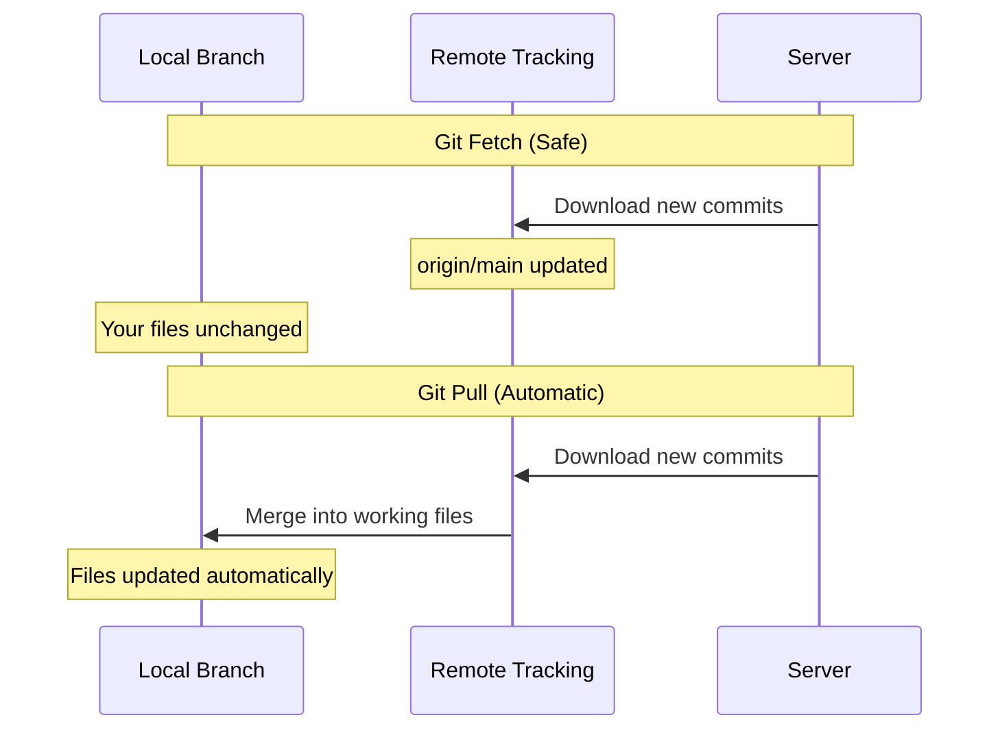

| Command | Safety | What It Does | Use Case |
|---------|--------|--------------|----------|
| `git fetch` | ✅ 100% Safe | Downloads changes but doesn't modify your files | Check what's new before merging |
| `git pull` | ⚠️ Risky | Downloads + immediately merges into your files | When you're sure no conflicts exist |

**git fetch** = `git fetch` (download only)

**git pull** = `git fetch` + `git merge` (download + merge)

**Example:**
```bash
# Safe approach
git fetch origin
git log origin/main  # Review changes
git merge origin/main  # Merge when ready

# Quick approach (can cause conflicts)
git pull origin main
```

---

### 5. Understanding Branches

Branches are simply **pointers** to specific commits.

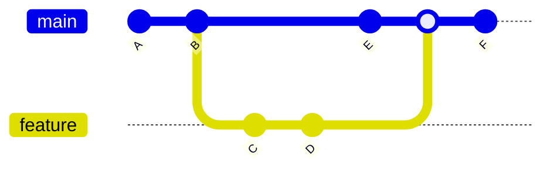

**Key Points:**
- 🎯 A branch is just a **movable pointer** to a commit
- 🌿 Creating a branch is lightweight (just creates a pointer)
- 🔄 Each branch can move independently
- 📍 Multiple branches can point to the same commit

**Example:**
```bash
# Create a new branch (just creates a pointer)
git branch feature

# Switch to it
git checkout feature

# Now commits move the 'feature' pointer forward
git commit -m "New feature"
```

---

### 6. Git Reset vs Git Revert

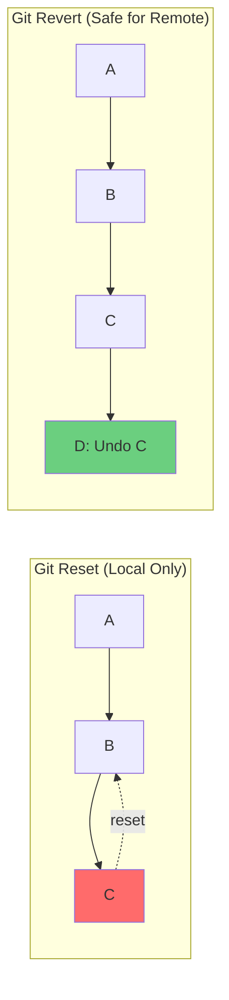

| Feature | `git reset` | `git revert` |
|---------|-------------|--------------|
| **Action** | Moves HEAD pointer backward | Creates new commit that undoes changes |
| **History** | Rewrites history | Preserves history |
| **Safety** | ⚠️ Dangerous if pushed | ✅ Safe for pushed commits |
| **Use Case** | Local mistakes | Undo pushed changes |

**Example:**
```bash
# Reset (for local commits)
git reset --hard HEAD~1  # Completely removes last commit

# Revert (for pushed commits)
git revert abc123  # Creates new commit undoing abc123
```

**Reset Options:**
```bash
# --soft: Keep changes in staging area
git reset --soft HEAD~1

# --mixed (default): Keep changes in working directory
git reset --mixed HEAD~1

# --hard: Discard all changes
git reset --hard HEAD~1
```

---

### 7. Git Reflog vs Git Log

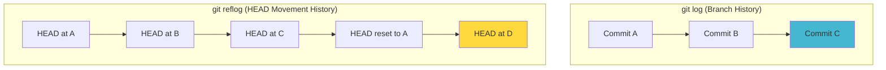

**git log:**
- Shows commit history of current branch
- Linear chronological view
- Only shows reachable commits

**git reflog:**
- Records **all movements** of HEAD
- Includes deleted/modified branches
- Can recover "lost" commits

**Example:**
```bash
# Regular history
git log --oneline
# abc123 Add feature
# def456 Fix bug
# ghi789 Initial commit

# Complete HEAD movement history
git reflog
# abc123 HEAD@{0}: commit: Add feature
# def456 HEAD@{1}: reset: moving to HEAD~1
# xyz999 HEAD@{2}: commit (amend): Fix typo
# def456 HEAD@{3}: commit: Fix bug
```

**Recovery Example:**
```bash
# Oops! Accidentally reset
git reset --hard HEAD~3

# Find lost commit
git reflog
# Find the commit hash

# Recover it
git reset --hard abc123
```

---

### 8. Git Amend

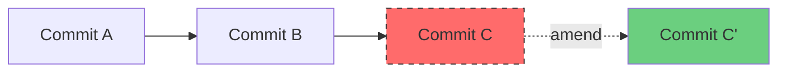

**Key Points:**
- ✏️ Modifies the **most recent commit**
- 🔄 Creates a **new commit** with a new hash
- 🗑️ Original commit is replaced
- ⚠️ Don't amend pushed commits (rewrites history)

**Example:**
```bash
# Forgot to add a file
git commit -m "Add feature"
# Oops! Forgot config.js

# Add the forgotten file
git add config.js

# Amend the last commit
git commit --amend --no-edit
# OR change the message
git commit --amend -m "Add feature with config"
```

---

### 9. Git Stash Data Structure

Git stash uses a **STACK** (LIFO - Last In, First Out)

```mermaid
graph TB
    subgraph Stack Structure
        S3[Stash@{0}<br/>Most Recent]
        S2[Stash@{1}]
        S1[Stash@{2}<br/>Oldest]
    end
    
    S3 -.->|pop/apply| W[Working Directory]
    
    style S3 fill:#6bcf7f
    style S2 fill:#81d4fa
    style S1 fill:#b3e5fc
```

**Stack Operations:**
- `git stash` → **Push** to stack
- `git stash pop` → **Pop** from stack (apply + remove)
- `git stash apply` → **Peek** (apply without removing)

**Example:**
```bash
# Save current work (push to stack)
git stash save "WIP: feature X"

# Multiple stashes
git stash list
# stash@{0}: On main: WIP: feature X
# stash@{1}: On main: Bug fix attempt
# stash@{2}: On feature: Experiment

# Apply most recent (stash@{0})
git stash pop

# Apply specific stash
git stash apply stash@{1}
```

---

### 10. Detached HEAD State

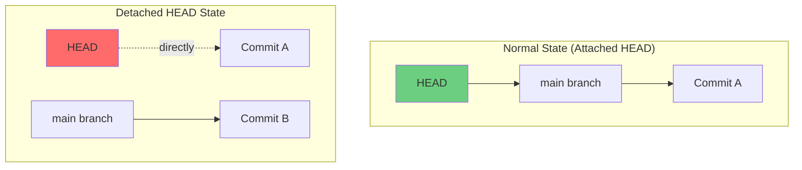

**Normal State:**
```
HEAD → branch → commit
```

**Detached HEAD:**
```
HEAD → commit (no branch)
```

**When it happens:**
- Checking out a specific commit
- Checking out a tag
- Checking out a remote branch directly

**Example:**
```bash
# Enter detached HEAD
git checkout abc123

# You'll see this warning:
# You are in 'detached HEAD' state...

# To save work from detached HEAD
git checkout -b new-branch-name

# Or to return to safety
git checkout main
```

---

### 11. Git Rebase vs Git Merge

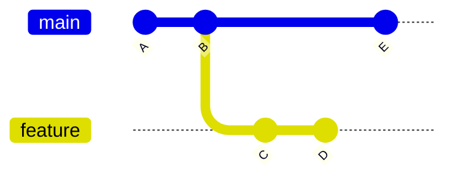

**After Merge:**
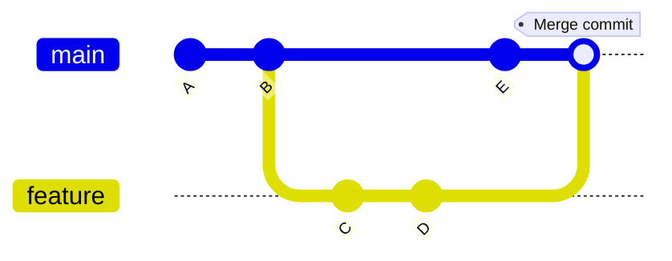

**After Rebase:**
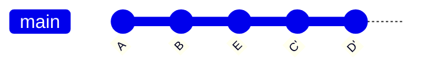

| Aspect | `git merge` | `git rebase` |
|--------|-------------|--------------|
| **History** | Preserves original | Rewrites history |
| **Result** | Merge commit created | Linear history |
| **Safety** | ✅ Safe for public branches | ⚠️ Never rebase public branches |
| **Use Case** | Feature → Main integration | Clean up local commits |

**Example:**
```bash
# Merge approach
git checkout main
git merge feature
# Creates merge commit

# Rebase approach
git checkout feature
git rebase main
# Moves feature commits on top of main

# Then fast-forward merge
git checkout main
git merge feature
```

**Golden Rule:** 
> ⚠️ **Never rebase commits that have been pushed to a public repository**

---

### 12. Interactive Rebase Options

```bash
git rebase -i HEAD~3
```

This opens an editor with:

```bash
pick abc123 Add login feature
pick def456 Fix typo
pick ghi789 Add tests

# Rebase commands:
# p, pick = use commit
# r, reword = use commit, but edit message
# e, edit = use commit, but stop for amending
# s, squash = use commit, meld into previous commit
# f, fixup = like squash, but discard commit message
# x, exec = run command
# d, drop = remove commit
```

**Options Explained:**

| Command | Symbol | What It Does | Example Use Case |
|---------|--------|--------------|------------------|
| **pick** | `p` | Use commit as-is | Keep important commits |
| **reword** | `r` | Edit commit message | Fix typo in message |
| **edit** | `e` | Pause to modify commit | Add forgotten files |
| **squash** | `s` | Combine with previous, edit message | Merge related commits |
| **fixup** | `f` | Combine with previous, discard message | Clean up "fix typo" commits |
| **exec** | `x` | Run shell command | Run tests after commit |
| **drop** | `d` | Delete commit | Remove unwanted changes |

**Example - Cleaning History:**
```bash
# Before
pick abc123 Add feature
pick def456 Fix typo
pick ghi789 Fix another typo
pick jkl012 Add tests

# After editing to:
pick abc123 Add feature
fixup def456 Fix typo
fixup ghi789 Fix another typo
pick jkl012 Add tests

# Result: 2 clean commits instead of 4
```

---

## 🛠️ Essential Commands

### Configuration

```bash
# Set your identity
git config --global user.name "Your Name"
git config --global user.email "your.email@example.com"

# View all configuration
git config --list

# View specific config
git config user.name
```

**Example Output:**
```
user.name=John Doe
user.email=john@example.com
core.editor=vim
color.ui=auto
```

---

### Repository Initialization

```bash
# Initialize new repository
git init

# Clone existing repository
git clone https://github.com/username/repository.git

# Clone into specific folder
git clone https://github.com/username/repository.git my-folder

# Clone specific branch
git clone -b branch-name https://github.com/username/repository.git
```

---

### Status and Differences

```bash
# Check repository status
git status

# Short status
git status -s

# View unstaged changes
git diff

# View staged changes
git diff --staged

# Compare two commits
git diff abc123 def456

# Check specific file
git diff filename.js

# Staged changes for specific file
git diff --cached filename.js
```

**Example Output:**
```bash
git status -s
# M  modified-file.js          # Modified, staged
#  M unstaged-changes.js       # Modified, not staged
# ?? new-file.js               # Untracked
# A  added-file.js             # New file, staged
# D  deleted-file.js           # Deleted, staged
```

---

### Staging and Committing

```bash
# Stage specific file
git add filename.js

# Stage all changes
git add .

# Stage all JavaScript files
git add *.js

# Commit staged changes
git commit -m "Add new feature"

# Stage and commit in one step
git commit -a -m "Fix bug"

# Commit with detailed message
git commit
# Opens editor for multi-line message
```

**Commit Message Best Practices:**
```bash
# Good commit message structure
git commit -m "feat: Add user authentication

- Implement JWT token generation
- Add login/logout endpoints
- Create user session management

Closes #123"
```

---

### Viewing History

```bash
# Full commit history
git log

# Compact one-line format
git log --oneline

# With graph
git log --graph --oneline --all

# Last 5 commits
git log -5

# Commits by author
git log --author="John Doe"

# Commits in date range
git log --since="2 weeks ago"

# Show changed files
git log --stat

# Show actual changes
git log -p
```

**Example Output:**
```bash
git log --oneline --graph --all
# * abc123 (HEAD -> main) Add feature
# * def456 Fix bug
# | * ghi789 (feature) Experiment
# |/
# * jkl012 Initial commit
```

---

### Remote Operations

```bash
# Push to remote
git push origin main

# Push and set upstream
git push -u origin main

# Push all branches
git push --all

# Force push (dangerous!)
git push --force

# View remotes
git remote -v

# Add remote
git remote add upstream https://github.com/original/repo.git

# Remove remote
git remote remove origin
```

---

### Checkout Commands

```bash
# Switch to branch
git checkout branch-name

# Create and switch to new branch
git checkout -b new-branch

# Switch to specific commit (detached HEAD)
git checkout abc123

# Discard changes in file (unstaged)
git checkout -- filename.js

# Modern alternative (Git 2.23+)
git switch branch-name
git switch -c new-branch
```

---

### Branch Management

```bash
# List all branches
git branch

# List all (including remote)
git branch -a

# Create new branch
git branch feature-name

# Rename current branch
git branch -m new-name

# Rename specific branch
git branch -m old-name new-name

# Delete branch (safe)
git branch -d feature-name

# Force delete branch
git branch -D feature-name

# Delete remote branch
git push origin --delete feature-name
```

---

### Branch Tracking

```bash
# View tracking information
git branch -vv

# Output example:
# * main    abc123 [origin/main] Latest commit
#   feature def456 [origin/feature: ahead 2] WIP

# View remote tracking
git remote show origin

# Set upstream for current branch
git branch -u origin/feature-name

# Push and set upstream
git push -u origin feature-name

# Create branch with tracking
git checkout -b feature --track origin/feature
```

---

### Merging

```bash
# Switch to target branch
git checkout main

# Merge source branch
git merge feature-branch

# Merge without fast-forward
git merge --no-ff feature-branch

# Abort merge
git merge --abort

# Continue after resolving conflicts
git merge --continue
```

**Handling Merge Conflicts:**
```bash
# 1. Merge attempt
git merge feature
# CONFLICT: Merge conflict in file.js

# 2. Check conflicted files
git status

# 3. Open file and resolve conflicts
# Remove conflict markers (<<<<, ====, >>>>)

# 4. Stage resolved files
git add file.js

# 5. Complete merge
git commit
```

---

### History Management

```bash
# Undo last commit, keep changes staged
git reset --soft HEAD~1

# Undo last commit, keep changes unstaged
git reset --mixed HEAD~1

# Undo last commit, discard changes
git reset --hard HEAD~1

# Revert a specific commit (creates new commit)
git revert abc123

# View reflog (recovery tool)
git reflog

# Amend last commit
git commit --amend

# Amend without changing message
git commit --amend --no-edit
```

---

### Stashing

```bash
# Stash current changes
git stash

# Stash with message
git stash save "WIP: feature X"

# List all stashes
git stash list

# Apply most recent stash
git stash apply

# Apply and remove most recent stash
git stash pop

# Apply specific stash
git stash apply stash@{2}

# Remove specific stash
git stash drop stash@{1}

# Remove all stashes
git stash clear

# Show stash contents
git stash show -p stash@{0}
```

---

### Advanced Commands

```bash
# Show who changed each line
git blame filename.js

# Short format
git blame -L 10,20 filename.js  # Lines 10-20 only

# Apply specific commit from another branch
git cherry-pick abc123

# Multiple commits
git cherry-pick abc123 def456

# Rebase onto another branch
git rebase main

# Interactive rebase
git rebase -i HEAD~3

# Continue after resolving conflicts
git rebase --continue

# Abort rebase
git rebase --abort

# Skip problematic commit
git rebase --skip
```

---

## 🎓 Common Workflows

### Starting a New Feature

```bash
# 1. Update main
git checkout main
git pull origin main

# 2. Create feature branch
git checkout -b feature/user-auth

# 3. Work on feature
git add .
git commit -m "feat: Implement user authentication"

# 4. Push to remote
git push -u origin feature/user-auth

# 5. Create Pull Request on GitHub
```

### Updating Feature Branch with Main

```bash
# Option 1: Merge (preserves history)
git checkout feature/user-auth
git merge main

# Option 2: Rebase (linear history)
git checkout feature/user-auth
git rebase main
```

### Fixing a Mistake in Last Commit

```bash
# Add forgotten files
git add forgotten-file.js
git commit --amend --no-edit

# Or change commit message
git commit --amend -m "Better message"
```

### Emergency Bug Fix

```bash
# Stash current work
git stash save "WIP: feature X"

# Create hotfix branch
git checkout main
git checkout -b hotfix/critical-bug

# Fix and commit
git add .
git commit -m "fix: Resolve critical bug"

# Merge to main
git checkout main
git merge hotfix/critical-bug

# Return to feature work
git checkout feature
git stash pop
```

---

## 📊 Quick Reference Table

| Task | Command |
|------|---------|
| Initialize repo | `git init` |
| Clone repo | `git clone <url>` |
| Check status | `git status` |
| Stage files | `git add .` |
| Commit | `git commit -m "message"` |
| Push | `git push origin main` |
| Pull | `git pull origin main` |
| Create branch | `git checkout -b branch-name` |
| Switch branch | `git checkout branch-name` |
| Merge | `git merge branch-name` |
| View history | `git log --oneline` |
| Undo commit (safe) | `git revert HEAD` |
| Undo commit (local) | `git reset --soft HEAD~1` |
| Stash changes | `git stash` |
| Apply stash | `git stash pop` |

---

## 🚨 Important Warnings

1. **Never rebase public/shared branches** - It rewrites history
2. **Be careful with `--force` push** - Can overwrite others' work
3. **Don't amend pushed commits** - Creates confusion for collaborators
4. **Always pull before push** - Avoid conflicts
5. **Use meaningful commit messages** - Future you will thank you

---

## 🎯 Best Practices

✅ **DO:**
- Commit often with clear messages
- Use branches for features
- Pull before starting work
- Review changes before committing
- Use `.gitignore` for sensitive files

❌ **DON'T:**
- Commit directly to main/master
- Force push to shared branches
- Commit large binary files
- Include passwords or secrets
- Rebase public history

---

## 📚 Additional Resources

- [Official Git Documentation](https://git-scm.com/doc)
- [GitHub Guides](https://guides.github.com/)
- [Git Cheat Sheet](https://education.github.com/git-cheat-sheet-education.pdf)
- [Interactive Git Tutorial](https://learngitbranching.js.org/)

---

## 🤝 Contributing

Found an error or want to add more examples? Feel free to contribute!

---

**Happy Coding! 🚀**
